I build things close to the metal: operating system internals, embedded firmware,
and silicon. B.S. Computer Engineering at UC Santa Cruz, finished in three years
(Sep 2023 to Aug 2026), minors in EE and CS.

```
   sensor  ──i2c──>  stm32  ──uart──>  esp32  ──lora──>  gateway  ──>  dashboard
     soil            tock os           arduino            the farm      dirtviz
```

### What I am working on

**Undergraduate researcher, [jLab](https://jlab.soe.ucsc.edu/) (Josephson Lab), ENTS project.**
Field reliability for solar powered soil sensing nodes deployed at the UCSC farm.
Firmware runs [ENTS-tock](https://github.com/jlab-sensing/ENTS-tock) on Tock OS.
I work on making sure a node in the dirt produces valid data that survives the
whole path to the dashboard, and on finding where it does not.

**Undergraduate researcher, PICO compute cluster.** Kubernetes research workloads,
Incus containers and VMs for reproducible experiment environments.

### Selected work

| Project | What it is |
| --- | --- |
| [**Matrix Inversion ASIC**](https://github.com/Azzu-bear/TinyTapeout_sky_MatrixInversion) | A 2x2 linear system solver in Verilog, taped out through TinyTapeout on SKY130. Full datapath and a 12 state FSM in a 1x1 tile at 50 MHz. Verified in cocotb through RTL and gate level, hardened to GDS with OpenLane. |
| [**Pintos kernel scheduler**](https://github.com/Azzu-bear/project4-pintos-threads) | Replaced busy waiting in the Pintos kernel with an ordered sleep list and timed wakeups driven from the 8254 timer ISR. Interrupts disabled around insertion to avoid racing the handler. All six alarm tests pass under QEMU. |
| [**FPGA VGA arcade game**](https://github.com/Azzu-bear/fpga-vga-arcade) | A three-lane endless runner rendered live to a VGA monitor from a Basys3, in Verilog. No framebuffer: a Basys3 cannot hold a 640x480 frame and there is no time to read one at 40 ns per pixel, so every object answers "is this pixel inside me?" combinationally from the beam position. |
| [**ENTS-tock**](https://github.com/jlab-sensing/ENTS-tock) | Lab firmware I contribute to. Routed stm32 log output over i2c to an esp32 so it lands on a microSD card, which meant extending the protobuf schema without growing the RAM footprint. |
| [**cse121-labs**](https://github.com/Azzu-bear/cse121-labs) | Embedded C on the ESP32-C3. I2C sensor bring up, BLE HID, RTOS tasks. |

### Toolbox

```
languages   C · C++ · Python · Verilog · Assembly (x86 / RISC-V)
systems     Linux · OS internals · concurrency · pthreads · sockets · memory management
embedded    Tock OS · ESP-IDF · FreeRTOS · STM32 · ESP32 · I2C · SPI · UART · BLE
silicon     SKY130 · OpenLane · cocotb · Vivado · Basys3
tools       git · gdb · valgrind · docker · kubernetes · neovim · tmux
```

### Reach me

[azamoham@ucsc.edu](mailto:azamoham@ucsc.edu) · [LinkedIn](https://www.linkedin.com/in/)

```
                    .  .  .
                 .           .          "the node is in the dirt,
               .    ~~~~~~~    .         the data had better be real"
              .   ~ soil   ~    .
               .   ~~~~~~~    .
                 .           .
                    '  '  '
```
